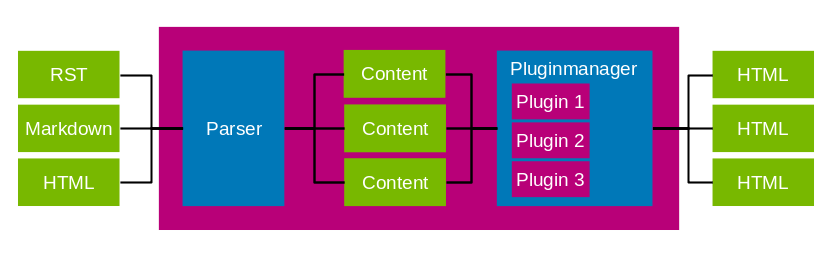

Basic Concepts
==============

Data flow
---------

Basically flamingo just converts markup files into HTML files. Flamingo searches
in ``settings.CONTENT_ROOT`` recursively for files with specific extensions
and creates ``flamingo.Content`` objects of them using individual parsers for
each extension
(more information on parsers:
{{ link('cookbook/how_to_write_a_parser.rst', 'how to write a parser') }}).
From there all plugins are free to change and add contents, before they get
rendered using Jinja2 and written into HTML files.

Context
-------

The ``flamingo.core.context.Context`` object holds all runtime state, with all
settings, loaded plugins and media information. It gets passed into every
plugin hook and is available in every rendered template and content object.

In the diagram above the context is shown as violet box.

Content / ContentSet
--------------------

``flamingo.Content`` objects are the main data store for user content.
Multiple ``flamingo.Content`` objects are stored in a ``flamingo.ContentSet``.

All content that is supposed to be written to the output should be a
``flamingo.Content``. You are not supposed to write to the output directly.

Content objects can be created by parsing a content file or by using
``flamingo.Content.add()``.

More information: {{ link('developer/data_model.rst', 'Data Model') }}

Plugins / Hooks
---------------

Plugins are meant to extend flamingo or to modify the flamingo context while
building. Plugins or hooks are the only places where you supposed to write
python code.

More information:
{{ link('cookbook/how_to_write_a_plugin.rst', 'how to write a plugin') }},
{{ link('cookbook/how_to_use_settings_hooks.rst', 'how to use a settings hook') }}

Media- and static files
-----------------------

Media files are part of the user content and are stored in ``CONTENT_ROOT``.
They get copied to the output only if they get referenced somewhere.

Static files get copied in every build, no matter if they get used or not.

A vacation photo for a blog post would be media file. The logo of your blog
would be a static file and part of a theme.

Themes
------

A flamingo theme consists of HTML, CSS, JS and other static assets.
They don't contain content files or python code but can be part of a plugin.

Layers
------

Layers are meant for all kind of non-content, static files that are very
project specific, or have to be at a very specific location in the build
output, for example a favicon or a Google analytics file.

More information: {{ link('plugins/layers.rst', 'layers documentation') }}
